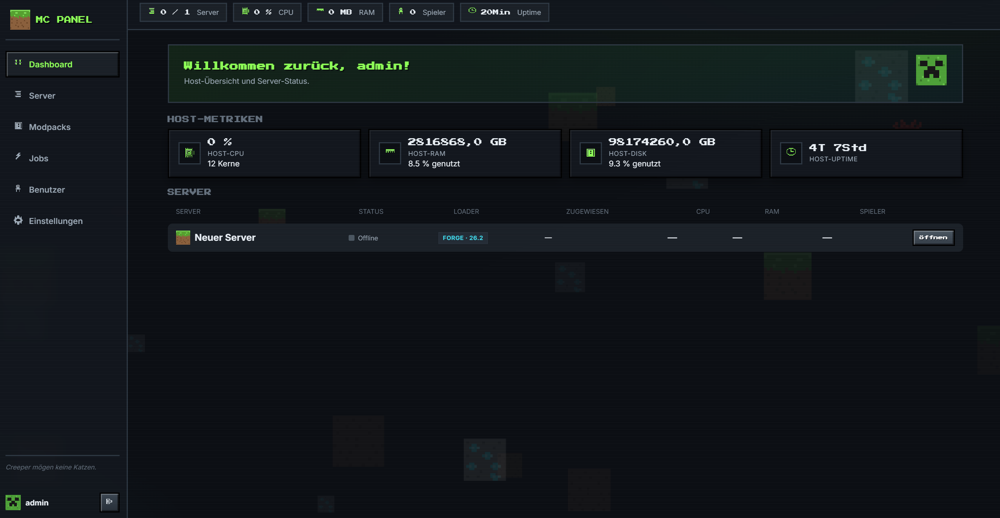
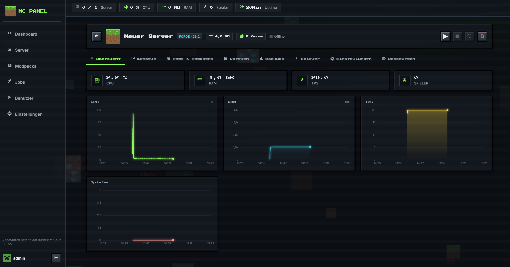
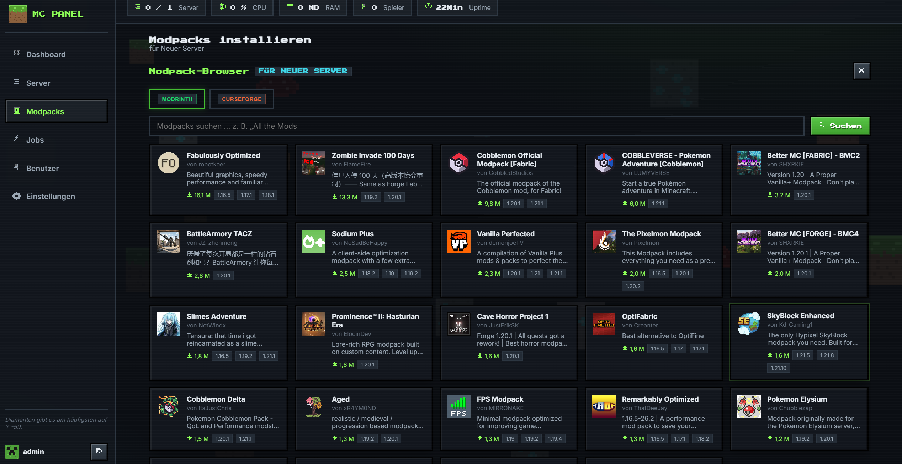
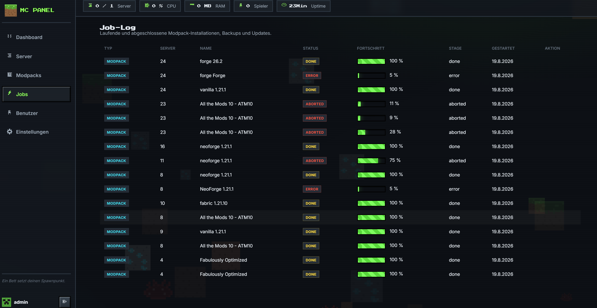
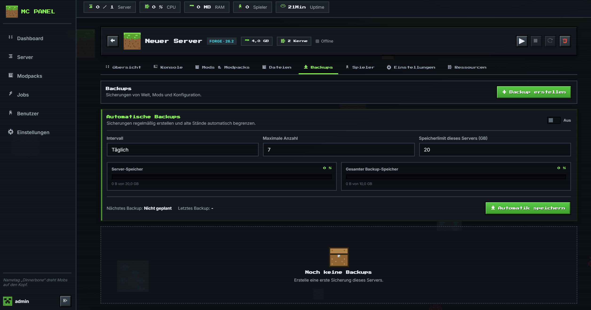
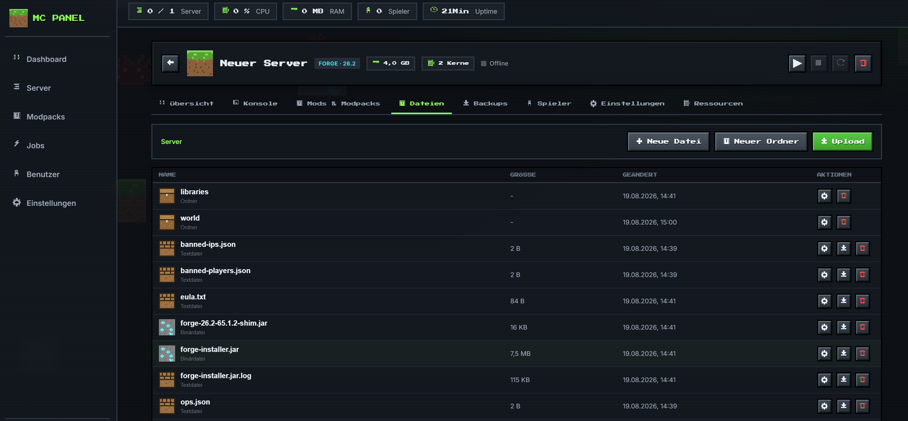
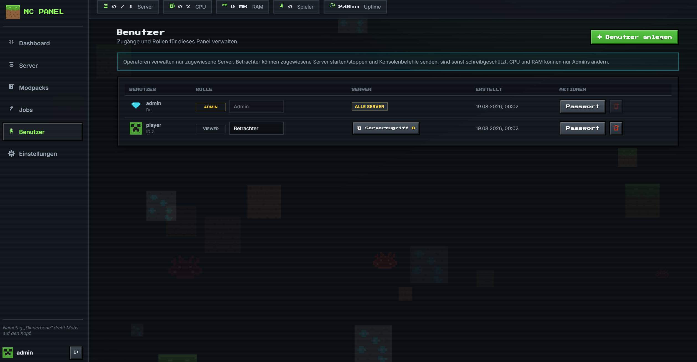
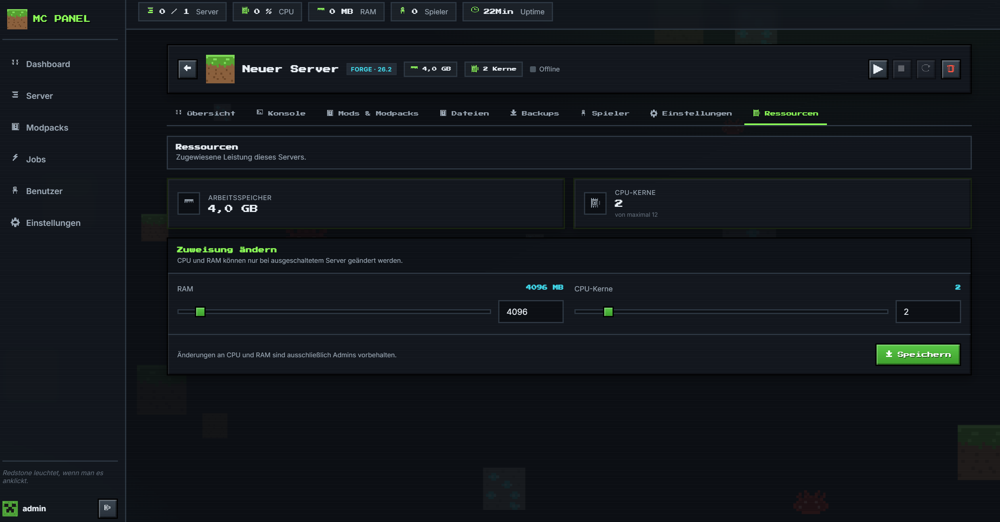
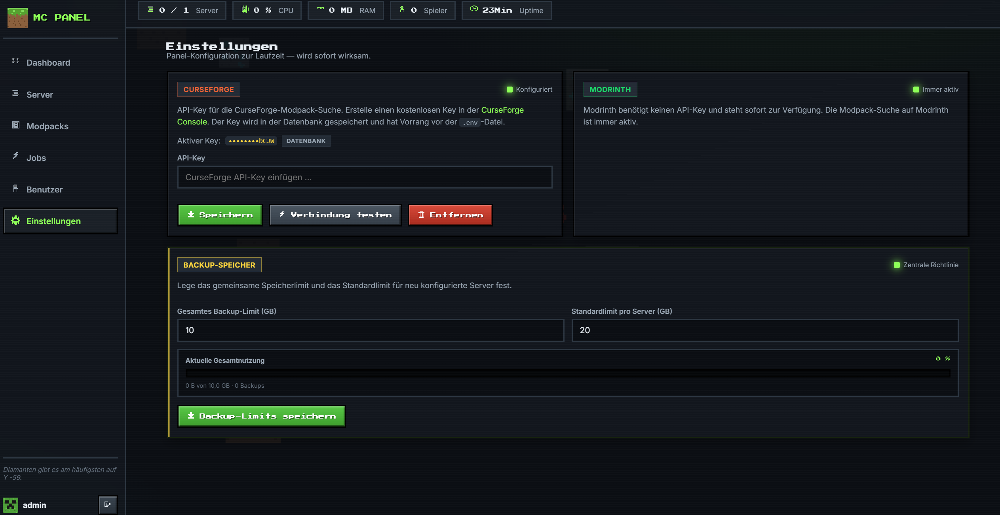
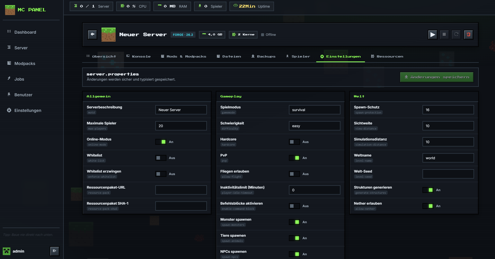

# MC Panel — Minecraft Hosting Panel

Ein verspieltes, dunkles Web-Panel zum Verwalten von Minecraft-Servern — mit Pixel-Art-Icons,
Animationen, flüssigen Live-Metriken (persistiert!) und Modpack-Installation via
**Modrinth** und **CurseForge**.

## Features

- 🎮 **Echte Server** — Vanilla, Paper, Fabric, Forge & NeoForge werden per
  **First-Install-Wizard** heruntergeladen und installiert (Loader → Version → EULA →
  Install mit Live-Fortschritt), dann als echte Java-Prozesse gestartet
  (OpenJDK 21 im Docker-Image). Fallback: Simulationsmodus, wenn kein Java verfügbar ist.
- 📈 **Flüssige Metriken** — CPU / RAM / TPS / Spieler als geglättete Canvas-Charts
  (LERP-Interpolation via requestAnimationFrame). Im Real-Modus kommen CPU/RAM echt vom
  Java-Prozess (pidusage), Spielerzahlen via `list`-Befehl. Alle Ticks werden in
  **SQLite persistiert** — die Charts bauen sich nie von null auf.
- 🧩 **Modpack-Browser** — Suche & Installation von [Modrinth](https://modrinth.com)
  (ohne API-Key) und [CurseForge](https://console.curseforge.com/) (API-Key nötig).
  Packs werden **echt angewendet**: entpackt, alle Mods landen in `mods/`, Overrides
  in `config/` & Co. Der **Install-Wizard** bietet Modpack-Auswahl direkt bei der
  Server-Einrichtung (Loader/Version werden vom Pack vorgegeben); bei Loader-Konflikt
  warnt das Panel und bietet „Neu aufsetzen (Welt bleibt erhalten)" an.
- ⚙️ **Einstellungen-Seite** (Admin) — CurseForge-API-Key zur Laufzeit eintragen,
  testen und löschen. Der Key wird in der DB gespeichert und hat Vorrang vor `.env`.
- 🖥️ **Live-Konsole mit Befehlen** — Server-Logs in Echtzeit (Socket.IO, 500 Zeilen
  persistiert); im Real-Modus werden Befehle direkt an das Server-stdin geschickt.
- 📁 **Datei-Browser pro Server** — Ordnernavigation, Texteditor, Upload/Download,
  Umbenennen und Löschen mit Path-Traversal- und Symlink-Schutz.
- 💾 **Backups pro Server** — ZIP-Backups und Restore als Streaming-Jobs mit
  Live-Fortschritt; Sicherungen liegen persistent im eigenen Docker-Volume.
  Automatische Zeitpläne (stündlich bis wöchentlich), Anzahl-Rotation sowie harte
  Speicherlimits pro Server und global verhindern unkontrolliertes Wachstum.
- 👥 **Spielerverwaltung** — bekannte/aktive Spieler, OP-Level 1–4, Whitelist,
  Ban und Pardon direkt aus dem Panel.
- 🔧 **Server-Properties-GUI** — typisierte und validierte Oberfläche für Gameplay,
  Welt, Netzwerk und allgemeine `server.properties`-Werte.
- 🔐 **Multiuser** — globale Panel-Benutzer mit Rollen `admin`, `operator`, `viewer`;
  Viewer dürfen zugewiesene Server starten/stoppen, Konsolenbefehle senden und
  Modpacks installieren (ansonsten read-only), Operatoren verwalten ausschließlich
  zugewiesene Server, Admins verwalten zusätzlich Benutzer/Secrets und weisen
  Serverzugriffe zu.
- 🧠 **Ressourcenzuweisung** — Admin-only CPU-Kerne und RAM pro Server. CPU wird
  per Linux-`taskset` gebunden und zusätzlich via JVM `ActiveProcessorCount` begrenzt;
  Nicht-Admins können die Zuweisung sehen, aber niemals verändern.
- 🔄 **Modpack-Updates** — automatische Prüfung auf neuere Versionen (Modrinth &
  CurseForge), Meldung im Web-Interface mit Update-Button. Vor jedem Update wird
  automatisch ein vollständiges Backup erstellt; schlägt es fehl, bricht das Update ab.
- 📊 **Admin-Dashboard** — Host-CPU, RAM, Disk und Uptime sowie eine kompakte
  Server-Liste mit jeweiligen Live-Metriken (nur Admins).
- 🧾 **Admin-Job-Log** — zentrale Übersicht für Modpack-, Installer-, Update- und
  Backup-Jobs mit Fortschritt, Fehlern und Abbruch aktiver Jobs.
- 🌙 **Dark Minecraft Theme** — Pixel-Art-SVG-Icons (Grass, TNT, Creeper, Diamant …),
  schwebende Blöcke im Hintergrund, Partikel-Bursts, XP-Bar-Animationen, „Press Start 2P".
- 🔐 **Auth** — JWT-Login (bcrypt-gehashte Passwörter), Rollen: `admin` / `player`.

## Screenshots

<table>
  <tr>
    <td width="50%"><a href="docs/screenshots/admin-dashboard.png"></a><br><sub><b>Admin-Dashboard</b> mit Host-Metriken und Serverliste</sub></td>
    <td width="50%"><a href="docs/screenshots/server-dashboard.png"></a><br><sub><b>Server-Dashboard</b> mit Live-Metriken und Charts</sub></td>
  </tr>
  <tr>
    <td width="50%"><a href="docs/screenshots/modpack-browser.png"></a><br><sub><b>Modpack-Browser</b> für Modrinth und CurseForge</sub></td>
    <td width="50%"><a href="docs/screenshots/job-log.png"></a><br><sub><b>Job-Log</b> für Installationen, Updates und Backups</sub></td>
  </tr>
  <tr>
    <td width="50%"><a href="docs/screenshots/backups.png"></a><br><sub><b>Backup-Verwaltung</b> mit Zeitplänen und Limits</sub></td>
    <td width="50%"><a href="docs/screenshots/file-browser.png"></a><br><sub><b>Datei-Browser</b> mit Editor und Upload</sub></td>
  </tr>
  <tr>
    <td width="50%"><a href="docs/screenshots/user-management.png"></a><br><sub><b>Benutzerverwaltung</b> mit Rollen und Serverzuweisungen</sub></td>
    <td width="50%"><a href="docs/screenshots/resource-allocation.png"></a><br><sub><b>Ressourcenzuweisung</b> für CPU-Kerne und RAM</sub></td>
  </tr>
  <tr>
    <td width="50%"><a href="docs/screenshots/server-settings.png"></a><br><sub><b>Server-Einstellungen</b> für Gameplay, Welt und Netzwerk</sub></td>
    <td width="50%"><a href="docs/screenshots/panel-settings.png"></a><br><sub><b>Panel-Einstellungen</b> für Provider und globale Backups</sub></td>
  </tr>
</table>

## Tech Stack

| Schicht | Technologie |
|---|---|
| Backend | Node.js 24, Express 5, Socket.IO |
| Datenbank | `node:sqlite` (eingebaut — keine nativen Builds nötig) |
| Frontend | Vanilla JS, handgerenderte Canvas-Charts, keine Build-Tools |
| Simulation | `processManager` simuliert Server-Prozesse mit realistischen Metrik-Verläufen |

## Quickstart

### Docker (empfohlen)

```bash
docker compose up -d --build
```

Läuft auf **`http://localhost:3100`** (Host-Port 3000 ist hier bereits durch open-webui
belegt — daher mappt der Stack 3100 → 3000; änderbar via `MC_PANEL_PORT` in `.env`).
Daten persistieren in den Volumes `panel-data` (SQLite-DB inkl. Metrik-Historie) und
`panel-servers` (heruntergeladene Modpacks).

```bash
docker compose logs -f     # Logs ansehen
docker compose down        # Stoppen
```

### Lokal

```bash
npm install
npm start          # oder: npm run dev (nodemon)
```

Dann `http://localhost:3000` öffnen (bzw. `PORT` aus `.env`).

**Demo-Logins:** `admin / admin123` · `player / player123`

Beim ersten Start werden 3 Demo-Server samt 3 h Metrik-Historie angelegt.

## Konfiguration (`.env`)

| Variable | Default | Beschreibung |
|---|---|---|
| `PORT` | `3000` | Web-Port |
| `DB_FILE` | `./panel.db` | SQLite-Datei (Metriken, Server, Mods, Jobs) |
| `JWT_SECRET` | — | Secret für Login-Tokens |
| `SIMULATION_MODE` | `false` (Docker) | `true` = simulierte Server (kein Java nötig), `false` = echte Java-Prozesse. Ohne Java-Binary fällt das Panel automatisch in die Simulation zurück |
| `METRICS_INTERVAL_MS` | `2000` | Tick-Intervall der Metriken |
| `METRICS_RETENTION_HOURS` | `48` | Aufbewahrung der Metrik-Historie |
| `CURSEFORGE_API_KEY` | — | Optional. Ohne Key bleibt CurseForge deaktiviert (Modrinth geht immer). Alternativ zur Laufzeit über die Einstellungen-Seite setzen (DB hat Vorrang) |

## API-Überblick

Alle Endpunkte (außer `/health` und `/api/auth/login`) benötigen `Authorization: Bearer <token>`.

| Methode | Endpunkt | Beschreibung |
|---|---|---|
| POST | `/api/auth/login` | Login → `{token, user}` |
| GET | `/api/servers` | Server inkl. letzter Metrik |
| POST | `/api/servers` | Server erstellen |
| POST | `/api/servers/:id/start|stop|restart` | Power-Aktionen (echte Java-Prozesse) |
| POST | `/api/servers/:id/command` | Befehl an Server-stdin senden |
| GET | `/api/loaders` | Verfügbare Loader + Modus (`real`/`simulation`) |
| GET | `/api/loaders/:loader/versions` | MC-Versionen eines Loaders (live von Mojang/Paper/Fabric/Forge/NeoForge) |
| GET | `/api/servers/:id/install-status` | Installationsstatus |
| POST | `/api/servers/:id/install` | Server installieren (202 → `{jobId}`, braucht `eulaAccepted: true`) |
| GET/PUT/POST/DELETE | `/api/servers/:id/files*` | Datei-Browser, Editor, Upload/Download |
| GET/POST/DELETE | `/api/servers/:id/backups*` | Backups erstellen, laden, wiederherstellen |
| GET/PUT | `/api/servers/:id/backup-settings` | Automatik, Intervall, Anzahl und Server-Quota |
| GET/PUT | `/api/backup-settings` | Globale Backup-Limits (Admin) |
| GET/POST | `/api/servers/:id/players*` | Spielerrechte, Whitelist und Bans |
| GET/PUT | `/api/servers/:id/properties` | `server.properties` lesen/speichern |
| GET/POST/PATCH/DELETE | `/api/users*` | Globale Benutzerverwaltung (Admin) |
| GET/PUT | `/api/users/:id/servers` | Serverzugriffe eines Benutzers (Admin) |
| GET/PUT | `/api/servers/:id/resources` | CPU/RAM lesen bzw. admin-only ändern |
| GET | `/api/servers/:id/updates` | Update-Status installierter Modpacks |
| POST | `/api/servers/:id/updates/check` | Update-Prüfung manuell anstoßen (Operator) |
| POST | `/api/servers/:id/update` | Update mit Vorher-Backup ausführen (Operator) |
| DELETE | `/api/servers/:id` | Löschen (Admin) |
| GET | `/api/servers/:id/logs?limit=200` | Persistierte Log-Zeilen |
| GET | `/api/servers/:id/metrics/history?minutes=60` | Metrik-Historie (≤360 Punkte, downsampling) |
| GET | `/api/metrics/summary` | Globale Kennzahlen (Topbar) |
| GET | `/api/admin/host-metrics` | Host-CPU/RAM/Disk/Uptime (Admin) |
| GET | `/api/admin/jobs` | Zentrales Job-Log (Admin) |
| POST | `/api/admin/jobs/:id/cancel` | Aktiven Job abbrechen (Admin) |
| GET | `/api/modpacks/providers` | Verfügbarkeit der Provider |
| GET | `/api/modpacks/search?provider=&q=` | Modpack-Suche |
| GET | `/api/modpacks/:provider/:id/versions` | Versionen eines Packs |
| POST | `/api/servers/:id/modpacks/install` | Install-Job starten (202 → `{jobId}`) |
| GET | `/api/modpacks/jobs/:jobId` | Job-Fortschritt pollen |
| GET/DELETE | `/api/servers/:id/mods(/:modId)` | Installierte Modpacks verwalten |
| GET | `/api/settings` | Einstellungen lesen (Admin, Key nur maskiert) |
| PUT/DELETE | `/api/settings/curseforge-key` | CurseForge-Key speichern/löschen (Admin) |
| POST | `/api/settings/curseforge-key/test` | Key gegen CurseForge testen (Admin) |

**Socket.IO-Events** (Server → Client): `metrics:tick`, `metrics:init`, `server:status`,
`log:line`, `modpack:progress`. Client sendet `subscribe <serverId>` im Detail-View.

## Projektstruktur

```
├── index.js                     # Entry: Express + Socket.IO + Boot
├── src/
│   ├── middleware/authMiddleware.js   # JWT requireAuth
│   ├── routes/api.js                  # Auth, Server, Logs, Metriken
│   ├── routes/modpacks.js             # Modpack-Suche & Install
│   └── services/
│       ├── database.js                # node:sqlite Schema + Seed-User
│       ├── serverService.js           # CRUD + Demo-Seed + 3h Metrik-Backfill
│       ├── processManager.js          # Simulierte Server-Prozesse + Logs
│       ├── metricsService.js          # Tick-Loop, Persistenz, Pruning, History
│       ├── modrinthService.js         # Modrinth API v2
│       ├── curseforgeService.js       # CurseForge API v1 (Key nötig)
│       └── modpackService.js          # Install-Pipeline (Download → Extract → Register)
└── public/
    ├── index.html
    ├── css/style.css                  # Dark Minecraft Theme
    └── js/
        ├── icons.js                   # Pixel-Art SVG Bibliothek
        ├── api.js                     # REST-Client (Bearer Token)
        ├── charts.js                  # SmoothChart: LERP-geglättete Canvas-Charts
        ├── views.js                   # Dashboard, Detail, Modpack-Browser
        └── app.js                     # Router, Socket, Toasts, Partikel, Hintergrund
```

## Lizenz

MIT
